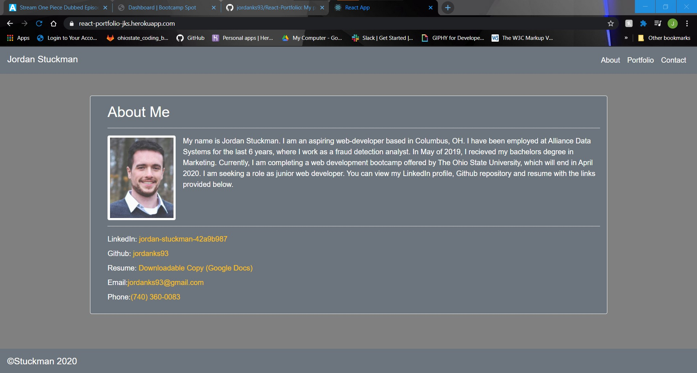
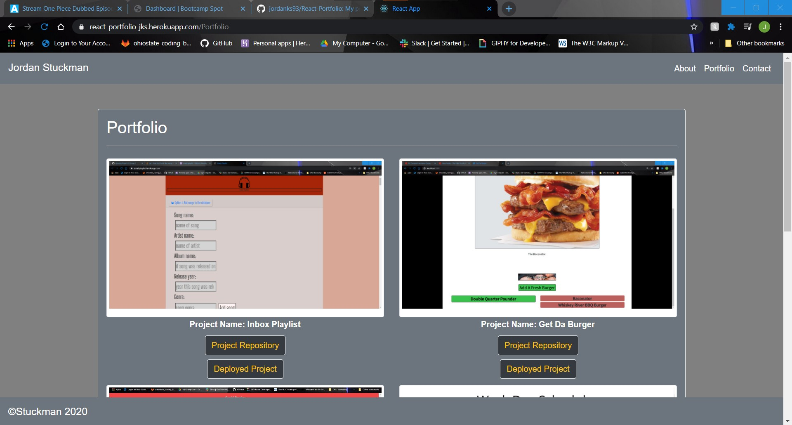
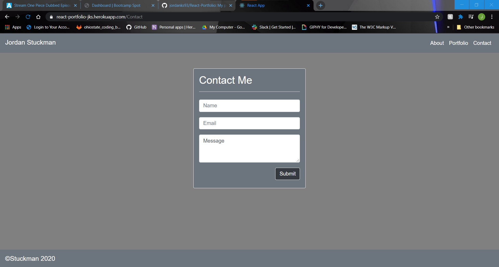

# React Portfolio

  ## Description
  My portfolio website in react. The app displays my contact information and examples of my web development projects. [Heroku Link](https://react-portfolio-jks.herokuapp.com/)

  
  
  

  ## Table of Contents
  * [Installation](#installation)
  * [Credits](#credits)
  * [Contributions](#contributions)
  * [Questions](#questions)
  * [License](#license)
   
  ## Installation
  1. Clone the repo from github 
  2. Pull up the project in your file directory 
  3. Type "npm i" into the console to install the required modules 
  4. Type "npm start" to run the program 
  5. The portfolio app will then load in your browser
  ## Credits
  Jordan Stuckman
  ## Contributions
  Contact me by email or just submit a pull request.
  ## Questions
  If you have any questions or feedback, contact me at jordanks93@gmail.com.
  My github profile is jordanks93.
  ## License
  MIT